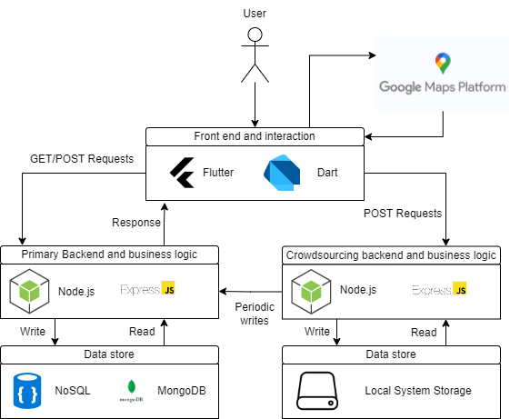

# FYP

Note: Please read the report for an in depth details of imlementation

Final Year Project for BAI Trinity College Dublin

The increasing use of CCTV surveillance devices and practices like facial recognition have become common in public spaces. These practices raise pertinent questions regarding an individual's right to privacy.

Accordingly, a user must be able to discern the kind of data being collected, processed and the purpose for which the collected data is being used for . As per the \ac{GDPR}, there must be transparency with the individual whose data is being collected and processed. Furthermore, the individuals must have the right to access a copy of their personal data(Article 15 \ac{GDPR}), thereby making it the organisation's responsibility to make this data available.

In this project, we take a look at the current legislation requirements, practices followed by organisations collecting CCTV surveillance data and improve data transparency with the intended user.

We also take a look at the current approaches taken by organisations to make their collected data more accessible. Current solutions are used as a basis for the project development and implementation while also taking a look at the shortcomings of current state of the art solutions.

This project finally develops a full stack system which consists of a publicly available registry consisting of the various locations of CCTV cameras, their privacy notices and the contact information of the organisation which collects surveillance data. This registry is used to present the user with a mobile application dashboard which allows the user to view these on a map. The dashboard allows the user to view the cross referenced CCTV location of cameras belonging to a variety of organisations and presents them with the contact information and associated privacy notices of the CCTV devices.

## System Arcitecture Diagram
The below architecture diagram shows the interaction of the entire system with the user.

## Screenshots
Development screenshots from the mobile application developed for Android and IOS using Flutter. 

